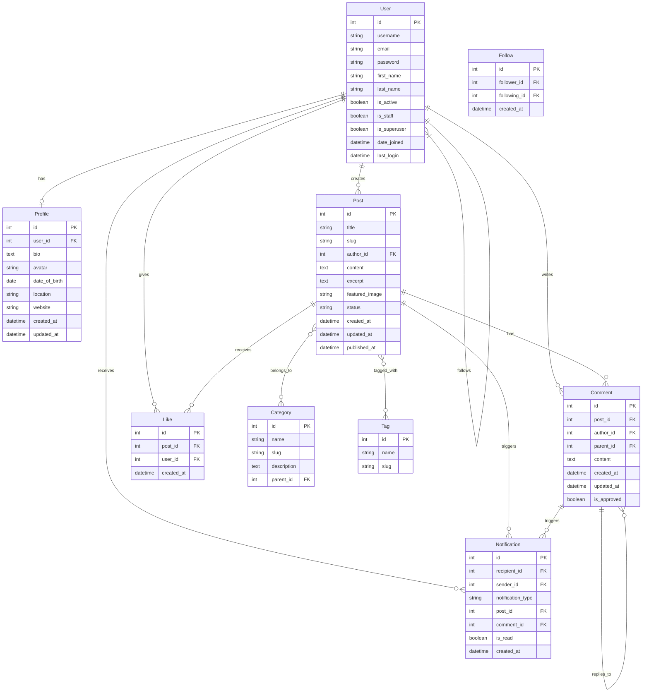

# Entity Relationship Diagram (ERD)

This document provides a visual representation of the Entity Relationship Diagram for the Django project using Mermaid syntax.

## Core Entities and Relationships

## Entity Descriptions

### User
The core user entity that represents registered users in the system. Users can create posts, comments, likes, and follow other users.

### Profile
Extended user information that is created automatically when a user registers. Contains personal information and preferences.

### Post
Blog posts created by users. Posts can belong to multiple categories and have multiple tags.

### Category
Organizational structure for posts. Categories can have parent categories, allowing for hierarchical organization.

### Tag
Keywords associated with posts for better searchability and organization.

### Comment
User comments on posts. Comments can be nested (replies to other comments) and require approval before being displayed.

### Like
Represents a user's like on a post. Each user can like a post only once.

### Follow
Represents the relationship between users where one user follows another.

### Notification
System notifications sent to users about various events (new comments, likes, follows, etc.).

## Relationship Types

### One-to-One (1:1)
- User to Profile: Each user has exactly one profile

### One-to-Many (1:N)
- User to Post: One user can create many posts
- User to Comment: One user can write many comments
- User to Like: One user can give many likes
- User to Notification: One user can receive many notifications
- Post to Comment: One post can have many comments
- Post to Like: One post can receive many likes
- Post to Notification: One post can trigger many notifications
- Comment to Comment: One comment can have many replies
- Comment to Notification: One comment can trigger many notifications

### Many-to-Many (M:N)
- Post to Category: A post can belong to multiple categories, and a category can have multiple posts
- Post to Tag: A post can have multiple tags, and a tag can be associated with multiple posts
- User to User (Follow): A user can follow many users, and a user can be followed by many users

## Data Types and Constraints

- **Primary Keys (PK)**: All entities have an auto-incrementing integer primary key
- **Foreign Keys (FK)**: References to other entities' primary keys
- **Timestamps**: Most entities include created_at and updated_at fields
- **Text Fields**: Used for longer content (bio, post content, comments)
- **String Fields**: Used for shorter text (usernames, titles, slugs)
- **Boolean Fields**: Used for flags (is_active, is_approved, is_read)
- **Date/DateTime Fields**: Used for temporal data (date_of_birth, created_at, published_at)

## Notes

- All entities include timestamps (created_at, updated_at) where appropriate
- Foreign keys are marked with (FK)
- Primary keys are marked with (PK)
- The diagram shows the cardinality of relationships using crow's foot notation
- Comments in the Mermaid diagram are marked with %%
- The diagram is organized by relationship groups for better readability 